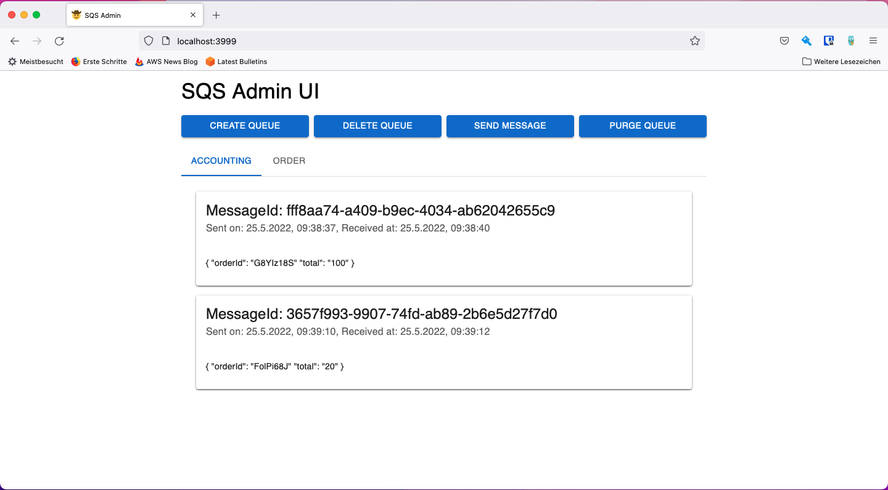

# SQS-Admin
<!-- ALL-CONTRIBUTORS-BADGE:START - Do not remove or modify this section -->

<!-- ALL-CONTRIBUTORS-BADGE:END -->

A minimal and lightweight UI for managing SQS-Queues for local development e.g. with [Localstack](https://localstack.cloud/).

## Why

There are already good UIs for SQS, but they are heavy with sizes >100 MB. Most likely because they ship with SQS itself.
If you choose e.g. Localstack for local development you don't need an additional local SQS setup, as it is already
provided by Localstack, unfortunately without UI.
This Alpine based image has a size ~19 MB. You can easily manage and create Queues.

## Usage

The most common way to use SQS-Admin would be in conjunction with a `docker-compose.yml`.
A working example can be found in the `example` directory.

You probably need to have a SQS up and running somewhere to connect to, e.g. via Localstack.
To start SQS-Admin simply run:
`docker run --rm -p 3999:3999 -e SQS_ENDPOINT_URL=<Endpoint-URL-of-our-SQS> -d pacovk/sqs-admin`

## Configuration

You can easily configure the Docker Container via the following environment variables:

| ENV              | Description                                                    | Default               |
| ---------------- | -------------------------------------------------------------- | --------------------- |
| SQS_ENDPOINT_URL | **Endpoint where SQS is running, this one is mostly required** | http://localhost:4566 |
| SQS_AWS_REGION   | AWS region the client internally uses to interact with SQS     | eu-central-1          |

## Contributing

If you want to contribute to this project, please read the [contribution guidelines](./CONTRIBUTING.md).

## Development

### Run local environment

To start your local development environment you can run ``make dev``. This will start a local backend (default http://localhost:3999) and the UI (default http://localhost:3000).

To configure the backend for local development you can set the following environment variable:

| ENV       | Description                                            | Default |
| --------- | ------------------------------------------------------ | ------- |
| HTTP_PORT | Port that the internal backend binds to and is serving | 3999    |

### Run tests

To run the tests you can run ``make test``. You'll need to shut down your local development environment afterward.

### Shutdown local environment

To shutdown your local development environment you can run ``make down``.

## Designed and tested with

## Contributors ✨

Thanks go to these wonderful people ([emoji key](https://allcontributors.org/docs/en/emoji-key)):
<!-- ALL-CONTRIBUTORS-LIST:START - Do not remove or modify this section -->
<!-- prettier-ignore-start -->
<!-- markdownlint-disable -->
<table>
  <tbody>
    <tr>
      <td align="center" valign="top" width="14.28%"><a href="https://pascal.euhus.dev/"> <b>PacoVK</b></a> <a href="https://github.com/PacoVK/sqs-admin/commits?author=PacoVK" title="Code">💻</a> <a href="https://github.com/PacoVK/sqs-admin/pulls?q=is%3Apr+reviewed-by%3APacoVK" title="Reviewed Pull Requests">👀</a> <a href="#projectManagement-PacoVK" title="Project Management">📆</a> <a href="#maintenance-PacoVK" title="Maintenance">🚧</a> <a href="#example-PacoVK" title="Examples">💡</a></td>
      <td align="center" valign="top" width="14.28%"><a href="http://erico.dev.br"> <b>Érico Knapp Lutzer</b></a> <a href="https://github.com/PacoVK/sqs-admin/commits?author=klutzer" title="Code">💻</a></td>
      <td align="center" valign="top" width="14.28%"><a href="https://github.com/stasadev"> <b>Stanislav Zhuk</b></a> <a href="https://github.com/PacoVK/sqs-admin/commits?author=stasadev" title="Code">💻</a></td>
      <td align="center" valign="top" width="14.28%"><a href="https://github.com/AlejandroPerez92"> <b>Alejandro Perez</b></a> <a href="https://github.com/PacoVK/sqs-admin/commits?author=AlejandroPerez92" title="Code">💻</a></td>
      <td align="center" valign="top" width="14.28%"><a href="https://github.com/adambordas"> <b>Ádám Bordás</b></a> <a href="https://github.com/PacoVK/sqs-admin/issues?q=author%3Aadambordas" title="Bug reports">🐛</a></td>
    </tr>
  </tbody>
</table>

<!-- markdownlint-restore -->
<!-- prettier-ignore-end -->

<!-- ALL-CONTRIBUTORS-LIST:END -->

### Legal note

UI favicon by [John Sorrentino](https://favicon.io/emoji-favicons/cowboy-hat-face)
